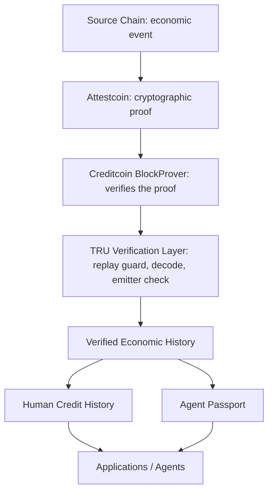

# TRU — Verification Infrastructure for Cross-Chain Economic History

TRU turns cross-chain economic events into cryptographically verified, reusable on-chain history.

TRU addresses a foundational infrastructure gap for a cross-chain credit ecosystem: turning verified cross-chain events into reusable economic history.

## The Problem

Economic activity happens on different chains, but downstream applications need reusable proof that an economic event actually happened. A repayment on Ethereum, or work completed for a counterparty on another chain, leaves no portable proof behind: a protocol on Creditcoin cannot independently verify it. Applications fall back on self-reported history, centralized APIs, or subjective scores, all of which ask you to trust the reporter rather than the evidence.

## The Primitive

TRU's infrastructure primitive is one pipeline:

Economic event → Attestcoin evidence → TRU verification → verified economic history → applications

TRU verifies the underlying source-chain event and records the verified fact, so consuming applications never rebuild cross-chain verification or historical recording themselves. TRU verifies facts; it never assigns subjective trust.

## Where TRU Fits

Other Chains → Attestcoin → TRU → Verified Economic History → Credit / Agents / Applications

Attestcoin provides the evidence. TRU makes that evidence useful.

## Why Attestcoin

Attestcoin provides the cryptographic proof that the source-chain event
actually happened: Creditcoin attests the source block, and the proof builder
returns a Merkle plus continuity proof for the transaction. TRU uses that
proof to establish verifiable economic history on Creditcoin. Without it, the
only alternatives are self-reports or trusted oracles.

## Event Model

TRU verifies economic events, not applications. Four event types flow through
the same primitive today:

- Loan originated
- Loan repaid
- Obligation created
- Obligation completed

Loans are one application of the underlying verification primitive.
Obligations generalize it to any economic actor, including autonomous agents.

## Agent Passport

Agent Passport is a consumer of verified history, not the core product. It is
a deterministic view derived from verified obligation events: counts, volumes,
and completion ratios recomputed from on-chain records. It is not an
AI-generated trust score, not an NFT, and not a token. Applications and agents
read it and apply their own policies.

## Why This Matters

TRU lets future Creditcoin applications consume verified economic events
without independently rebuilding cross-chain verification and historical
recording. Verification happens once, on shared infrastructure; every consumer
reads the same facts.

## Current Applications

Only cross-chain credit history and autonomous-agent obligation history are
implemented. Everything else is a future consumer of the same primitive.

## Agent Economic History

Obligation history is the second implemented consumer of the primitive. The
flow in full:

```
Agent performs economic obligation
→ Obligation is completed
→ Source-chain event is proven (Attestcoin / BlockProver verification)
→ Creditcoin records the verified fact
→ Agent Passport updates
```

Facts, not subjective scores.

Obligation completion history for executors, where the executor may be an
autonomous agent. An agent here means **any address**: the code treats every
executor uniformly as an address with a verifiable history. The live demo executor was a fresh wallet acting as an autonomous executor address; no
autonomous AI operates anywhere in the system.

```
Obligation → completion → attestation → cryptographic proof → BlockProver → TRU → verified obligation history
```

A requester creates an obligation for an executor through
`SourceObligationMarket` (`createObligation(executor, value, deadline)` →
`ObligationCreated`). The executor completes it (`completeObligation(id)` →
`ObligationCompleted`, restricted to the designated executor while `ACTIVE`).
The same worker, proof path, and `TRUUniversalContract` verification flow
prove both events on Creditcoin (`executeObligationCreated` /
`executeObligationCompleted`), and `TRUCreditRegistry` records them as
`VerifiedObligationEvent` history with lifecycle (`NONE → ACTIVE →
COMPLETED`).

**Agent Passport is a deterministic view of an agent's verified economic
history.** It is the struct returned by `getAgentPassport`: nine fields
(`subject`, `verifiedObligations`, `completedObligations`,
`failedObligations`, `activeObligations`, `verifiedSettlementVolume`,
`verifiedSourceChains`, `obligationHistory`, `completionRateBps`), each
recomputed live from verified events. For example, `completionRateBps =
completed * 10000 / verified`. It is not an NFT, not a token, and not an
AI-generated reputation score. It currently records `Created` and `Completed`
events; `failedObligations` is deterministically `0` because no verified
failure path exists yet (see Current Limitations).

TRU does NOT assign a subjective trust score. It records verifiable facts
such as completed obligations. An application or autonomous agent then applies
its OWN policy to those facts: it queries a counterparty's passport, applies
its own thresholds, and decides whether and how to transact.

## Human Economic History

Loan repayment history for human borrowers. **Credit is TRU's first
application, not the boundary of the protocol.**

```
Loan → repayment → cross-chain proof → verified registry event → reusable repayment history
```

A borrower creates a loan on Ethereum Sepolia through `SourceLoanMarket`
(`LoanCreated`), then repays it (`LoanRepaid`). The worker waits for
Creditcoin attestation of the Sepolia block, builds a Merkle plus continuity
proof, and submits it to `TRUUniversalContract`, which verifies the proof,
checks the emitter, and forwards the facts to `TRUCreditRegistry`. The
registry updates the borrower's profile (`repayments`, `totalRepaid`,
`creditLimit = 0 + repayments*100`), appends a `VerifiedFinancialEvent`, and
tracks loan lifecycle (`NONE → ACTIVE → REPAID`). `TRUFinancing` gates
`requestFinancing` on `creditState >= BUILDING` and `amount <= creditLimit`
without disbursing funds.



## Live Testnet Proof

Every entry below was re-verified against live RPCs: the Sepolia
transactions exist at the stated blocks, and all five CC3 execute
transactions carry receipts with status 1 at the stated blocks. Sepolia links
open Etherscan; CC3 links open the Creditcoin testnet Blockscout instance
cited in `docs/usc-research.md`. Registry state grows as new events verify;
figures describe these runs.

| Step | Source tx (Sepolia) | Proof tx (CC3) | Result |
| --- | --- | --- | --- |
| Loan originated (borrower `0x2b37…`) | [`0x74d0e459…`](https://sepolia.etherscan.io/tx/0x74d0e459379fb89894db4d2b7903f15cb18ec27e90669c0f8743380f9749ac8a) block `11580721` | [`0xdd9e4e71…`](https://creditcoin-testnet.blockscout.com/tx/0xdd9e4e7183c816776aab9b69b45f5578406035555181fee24ee5bc09bccfaf3c) block `5385429` | `loanStatus ACTIVE` |
| Loan repaid | [`0xc21ea7d1…`](https://sepolia.etherscan.io/tx/0xc21ea7d1505fcbbc10ff1ebbf1e5774e3608296652cb0bca17787bd35a34db8e) block `11581259` | [`0xe0a48f58…`](https://creditcoin-testnet.blockscout.com/tx/0xe0a48f58639dcb7aab0d1f84ffe6eeade1df7076eaf9040fb815ee660d5f2b4d) block `5385870` | `repayments 1`, `totalRepaid 123456789`, `creditLimit 100`, `BUILDING` |
| `requestFinancing(50)` | CC3-only call | [`0xa8117461…`](https://creditcoin-testnet.blockscout.com/tx/0xa8117461a266471e2b67ebccc8d5d7f302d3e6484f31d2698872f0613525b097) block `5385873` | recorded; over-limit and `NEW`-state requests revert |
| Obligation created (agent `0x8FC1…`, fresh wallet as autonomous executor) | [`0x9591e621…`](https://sepolia.etherscan.io/tx/0x9591e6219585e73fc1c3e10421e5a818347b50254d6e9cf99e2cdfdd71677617) block `11663848` | [`0xe7961a54…`](https://creditcoin-testnet.blockscout.com/tx/0xe7961a54e83e2b57a47fd02189fd37ae503f50421798c53cadc2751f208dd5a1) block `5454388` | `ACTIVE` (464.0s cold attestation) |
| Obligation completed | [`0x3aa9af68…`](https://sepolia.etherscan.io/tx/0x3aa9af68306d2e646d491b48de3878ebc5d093f05414e88dac7e949bf491a40c) block `11663849` | [`0xc19bc7df…`](https://creditcoin-testnet.blockscout.com/tx/0xc19bc7df91805a135d5b4a3a1191c53488cc76ee6f3050b3f56f7bb35d0226b8) block `5454391` | `COMPLETED` (2.3s, already attested) |
| Agent Passport (view) | n/a, read-only view | n/a | `verified 1, completed 1, active 0, volume 9000, 10000 bps, chains [1]` |

A second self-obligation for `0x2b37…` (create `0x5a2757…`, complete
`0x9eb372…`) was also verified live, showing the primitive works for both
human and agent addresses. Earlier independent runs (phases 0, 4, 6,
attestation timing) used superseded deployments and are historical proof, not
live state.

## Demo Flow

Create → Complete → Prove → Passport Update. The reproducible script is
`creditcoin/src/demo-obligation.mjs` (`npm run demo:obligation --
<agentAddress>`); the full click-by-click script is `docs/DEMO_PLAN.md`. Live
frontend: https://tru-ctc.vercel.app. No wallet is needed to browse verified
history; connecting one shows live state for that address.

## The Verification Pipeline

```
Source Chain (Sepolia)
  SourceLoanMarket / SourceObligationMarket emit the event
  ↓
Attestcoin, Creditcoin attests the source block (~35-block standing lag,
10-block batches; cold attestation ~7–9 min, predictable, already-attested
blocks instant)
  ↓
Merkle / continuity proof, proof builder returns proof for the tx hash;
worker sanity-checks with BlockProver verifySingle (eth_call)
  ↓
Creditcoin BlockProver (precompile 0x…0FD2), verifyAndEmit proves inclusion,
reverts on any tampered byte
  ↓
TRUUniversalContract, txIndex via precompile → queryId =
keccak(chainKey, blockHeight, txIndex) → replay guard → verify → decode
expected event from verified receipt → emitter check against configured
market → forward to registry
  ↓
TRUCreditRegistry, UC-gated record (replay + duplicate + lifecycle guards),
history append
  ↓
Verified Economic History, getCreditPassport / getAgentPassport and
paginated event views
```

Each step is evidenced in `docs/ATTESTCOIN-INTEGRATION.md` (timing) and
`docs/phase-5-security.md` (rejection cases).

## Architecture

```
Sepolia (Ethereum)                               Creditcoin CC3 Testnet
─────────────────                                 ────────────────────────
SourceLoanMarket                                  BlockProver precompile 0x…0FD2
 createLoan() -> LoanCreated                      ▲ verifyAndEmit(proof) -> reverts
 repayLoan()  -> LoanRepaid                      │ "Merkle proof validation failed"
SourceObligationMarket                            │ on any tampered byte
 createObligation() -> ObligationCreated          │
 completeObligation() -> ObligationCompleted      │
      │  tx hash (any market)                    │
      ▼                                          │
 worker (off-chain relay + proof construction)    │
  polls /api/v1/attested-height/1                 │
  ProofBuilder.getProof(txHash)                   │
  ───────── USC proof ───────────────────────►    │
                                    ┌──────────────────────────────┐
                                    │ TRUUniversalContract         │
                                    │ processedQueries[queryId]    │
                                    │ decode LoanCreated /         │
                                    │ LoanRepaid /                 │
                                    │ ObligationCreated /          │
                                    │ ObligationCompleted, check   │
                                    │ emitter == configured market │
                                    └──────────────┬───┬───────────┘
                                                   │   │
                                          Loan*   Obligation*
                                                   │   │
                                          TRUCreditRegistry (CC3)
                                           loanStatus / obligationStatus
                                           borrowerEvents / subjectObligationHistory
                                           getCreditEvidence / getCreditPassport
                                           getAgentPassport / getObligationEvents
                                                   │
                                                   ▼
                                          Downstream consumers
                                           TRUFinancing (reads getCreditEvidence)
                                           Any app/agent (reads getAgentPassport)
```

* Loan* = LoanCreated / LoanRepaid → `VerifiedFinancialEvent` history.
  Obligation* = ObligationCreated / ObligationCompleted → `VerifiedObligationEvent` history.
  Both flow through the same `verifyAndEmit` + emitter + replay checks.

The worker is a relay and proof-construction component: it transports proof
bytes and never decides what gets credited. Only `verifyAndEmit` success plus
the emitter check can write registry state. All four execute paths share one
primitive (identical verify → guard → decode → forward structure; see
`docs/ENGINE_AUDIT.md` §1).

## Technical Implementation

- **SourceLoanMarket** (Sepolia): creates loans for `msg.sender` and accepts
  repayment only from the owning borrower while active. Emits `LoanCreated`
  and `LoanRepaid`. Knows nothing about Creditcoin.
- **SourceObligationMarket** (Sepolia): creates obligations naming any
  executor address with a value and deadline; completion restricted to the
  designated executor while active. Emits `ObligationCreated`,
  `ObligationCompleted` (and `ObligationFailed`, not yet verified by TRU).
  Knows nothing about Creditcoin.
- **TRUUniversalContract** (CC3): verification front door. Four entry points
  (`execute`, `executeLoanOrigination`, `executeObligationCreated`,
  `executeObligationCompleted`) sharing one replay guard and one proof path;
  per-type receipt decoders with per-market emitter checks. Contains no
  credit logic.
- **TRUCreditRegistry** (CC3): history store. UC-gated record functions with
  replay, duplicate, lifecycle, and executor-mismatch guards; deterministic
  `CreditState` tiers (`NEW` 0, `BUILDING` 1–2, `ESTABLISHED` 3–5, `VERIFIED`
  6+ repayments) and `creditLimit = 0 + repayments*100`; `getAgentPassport`
  and paginated history views. Contains no proof logic.
- **TRUFinancing** (CC3): read-only consumer of verified credit state.
  Immutable registry reference; `requestFinancing` records (never disburses).

## Security / Verification Guarantees

Confirmed by `docs/ENGINE_AUDIT.md` and `docs/SECURITY_AUDIT.md`:

- **Emitter validation:** each decoder requires the log emitter to equal the
  configured source market (`Not SourceLoanMarket emitter` /
  `Not SourceObligationMarket emitter`); obligation decoders fail closed when
  the market is unset.
- **Replay protection:** global `processedQueries[keccak(chainKey,
  blockHeight, txIndex)]` in the universal contract plus per-domain replay
  maps in the registry; live replays revert `Query already processed`.
- **Duplicate protection:** `countedLoans[borrower][loanId]`,
  `loanStatus`, and `obligationStatus` reject second crediting of the same
  loan or obligation.
- **Source-chain validation:** `chainKey` and `blockHeight` passed to
  `verifyAndEmit` bind the proof to one chain and block; a proof for another
  chain or block fails verification.
- **Registry authorization:** all four record functions are
  `onlyUniversalContract`; admin setters are owner-only with zero-address
  rejection on `setRegistry` / `setUniversalContract`.
- **Event isolation:** loan and obligation histories use separate mappings and
  views; loan accounting never reads obligation storage and vice versa
  (`test_loanAndObligationHistoriesAreIsolated`).
- **Proof verification:** state changes only after `verifyAndEmit` success;
  tampered bytes, wrong events, and failed source transactions all revert
  with explicit reasons.

## Testing

`forge test`: **92 passed, 0 failed, 0 skipped** across 8 suites
(7 `SourceLoanMarket`, 7 `SourceObligationMarket`, 7 `TRUFinancing`,
13 `TRUUniversalContract`, 47 `TRUCreditRegistry`, 11 audit:
relay-boundary, rotation-immutability, lifecycle-pinning, gas-scaling,
UC-admin, full-path replay/tamper), solc `0.8.28`.
`forge build` is clean apart from pre-existing `block.timestamp`/typecast
lint notes. There is no separate typecheck step in this repo; contract
correctness is covered by the Forge suite plus live testnet runs.

## Repository Structure

```
contracts/src/sepolia/        SourceLoanMarket, SourceObligationMarket
contracts/src/creditcoin/     TRUUniversalContract, TRUCreditRegistry, TRUFinancing
contracts/src/creditcoin/interfaces/  ITRUCreditRegistry (shared types)
contracts/test/               5 Forge suites, 81 tests
contracts/deployments/        current addresses + ABIs (single source of truth)
creditcoin/src/worker.mjs     proof relay for all four event types
creditcoin/src/driver.mjs     source-chain helper (create/repay loans)
creditcoin/src/deploy-production.mjs  deploys + wires all five contracts
creditcoin/src/demo-obligation.mjs    reproducible obligation demo (npm run demo:obligation)
docs/                         phase reports, audits, integration + product docs
```

## Getting Started

Requires Sepolia and Creditcoin CC3 testnet RPC endpoints plus funded
testnet keys in `creditcoin/.env` (`SOURCE_RPC_URL`, `SEPOLIA_PRIVATE_KEY`,
`CREDITCOIN_RPC_URL`, `CREDITCOIN_PRIVATE_KEY`, `PROOF_BUILDER_URL`).

```
cd contracts
forge build
forge test
```

```
cd creditcoin
node src/deploy-production.mjs
```

This deploys `SourceLoanMarket` and `SourceObligationMarket` to Sepolia, then
`TRUCreditRegistry`, `TRUUniversalContract` (with `decoder`, `registry`, and
`sourceLoanMarket` constructor args, then `setSourceObligationMarket`), and
`TRUFinancing` (with the just-deployed registry address) to CC3, and
configures `TRUCreditRegistry.setUniversalContract`. All addresses and ABIs
are written to `contracts/deployments`.

```
# process a single loan or obligation event (auto-detected)
node creditcoin/src/worker.mjs --tx <sepoliaTxHash>

# listen from a block
node creditcoin/src/worker.mjs --from-block <N> --process-count 1

# reproducible obligation demo against live registry state
npm run demo:obligation -- <agentAddress>
```

## Current Limitations

Testnet only; no mainnet state exists. `failedObligations` is deterministically
`0` because `ObligationFailed` has a source event but no verified path yet, a deliberate boundary, not a missing test. Neither source completion nor the
registry enforces deadlines. Obligation and loan IDs live in single-market
namespaces (one market per type assumed). Passport views loop in `O(n²)`,
correct at current volume. The deployment owner key is fully trusted (can
re-point markets/registry), and on testnet the operator key currently equals
the owner key, separate before production. Proof submission itself is permissionless (no access control on the UC `execute*` functions, only proof-validity and replay checks), so additional relayers can run without coordination. The known self-loan gap persists
for loans. Cold attestation takes ~7–9 minutes (predictable from the
attested-height gap, not reducible). Active-loan stubs were removed rather
than faked; `TRUFinancing` approves on eligibility alone with no disbursement.
Audit additions (2026-09-12, forge-proven, no redeploy): the passport and
evidence views scan history with nested dedup loops, so read cost grows
superlinearly (forge-measured: passport 33k gas at 2 obligations vs 159k at
8; evidence 3.9k at 2 repayments vs 24k at 8). All state-changing writes are
O(1). The only on-chain read of a view is `TRUFinancing.requestFinancing`
via `getCreditEvidence`; safe at current volume, first bottleneck to remove
in production (incremental counters). Separately, `queryId =
keccak(chainKey, blockHeight, txIndex)` carries no event type, so two
different event types in one source transaction would collide and the second
could never be recorded. Neither finding permits forgery or double-credit;
both are liveness-at-scale bounds, now pinned by tests. No timelock exists:
at testnet stage the owner key is fully trusted by design, and a timelock's
production model is documented, not implemented.

## Future Consumers

None of the following are implemented. Each would consume verified history
rather than rebuilding verification:

- Underwriting against proven repayment and completion histories
- Delegated finance gated on verified track records
- Merchant and counterparty risk decisions from verified events
- Autonomous commerce between agents reading each other's passports

Protocol-side future work (also not implemented): verified failure lifecycle,
unified loan-plus-obligation timeline view, additional source chains, and
mainnet deployment.

## Contract Addresses

Current deployment only (previous phase addresses superseded):

| Contract | Chain | Address | Deploy Tx |
| --- | --- | --- | --- |
| SourceLoanMarket | Sepolia (`11155111`) | `0x9953AC50803f85EaA666B7724a7B165504B9c2e1` | `0xfdd5cb3e248a78aa232f32e963a090c6f0b7452af33a92ba4c2ddb870fdc0993` |
| SourceObligationMarket | Sepolia (`11155111`) | `0x133A8Fe8408066B95034Ed638f5C7083Be94d14F` | `0x174d715ab49b14836a90118e06ec58a67bfd755242af8053b2f31ec6b0a6079e` |
| TRUCreditRegistry | CC3 (`102031`) | `0x0D2707D258A87b971fd4cd78232304a672CA43c0` | `0x54e5f166cf17048ee471ef2e4699677f9afd1fbf095ff15bd7f47cc032689d27` |
| TRUUniversalContract | CC3 (`102031`) | `0xa33fd898502de87aA52C5992483b74f471613Ef0` | `0x1264d53753736398f33330340f983e4be5f0f336f514a2f13af612105b64a125` |
| TRUFinancing | CC3 (`102031`) | `0xd971aeaAc0D7216c41CccEdc5F4d6EF539Cad0bB` | `0x634cbf7119c03c1d3a4d6bcb96e592ef22cce2770717ce80eaa3ef33d7f0bca6` |
| EvmV1Decoder (deployed library) | CC3 | `0x731c345d79Fb8BbDC541f9DF3b6317585F849F9f` |, |
| BlockProver precompile | CC3 | `0x0000000000000000000000000000000000000FD2` |, |
| ChainInfo precompile | CC3 | `0x0000000000000000000000000000000000000fd3` |, |

## Technical Documentation

- `docs/ATTESTCOIN-INTEGRATION.md`, why Attestcoin is load-bearing, SDK
  calls, chainKey vs chainId, attestation timing, tamper walkthrough, oracle
  comparison.
- `docs/VERIFIABLE_ECONOMIC_HISTORY.md`, the obligation extension: design,
  trust model, tests, live verification with exact hashes and blocks.
- `docs/ENGINE_AUDIT.md`, the shared five-step primitive, history storage,
  passport derivations, remaining limitations.
- `docs/SECURITY_AUDIT.md`, full audit: trust model, verification boundary,
  access control, replay/duplicate protection, findings (no Critical/High),
  explicit trust assumptions.
- `docs/PRODUCT_ARCHITECTURE.md`, product mapping, core primitive evidence,
  claims audit (claim now / carefully / do not claim), canonical narrative.
- `docs/phase-*.md`, `docs/attestation-timing.md`, `docs/usc-research.md`,   per-phase build evidence and protocol research.
