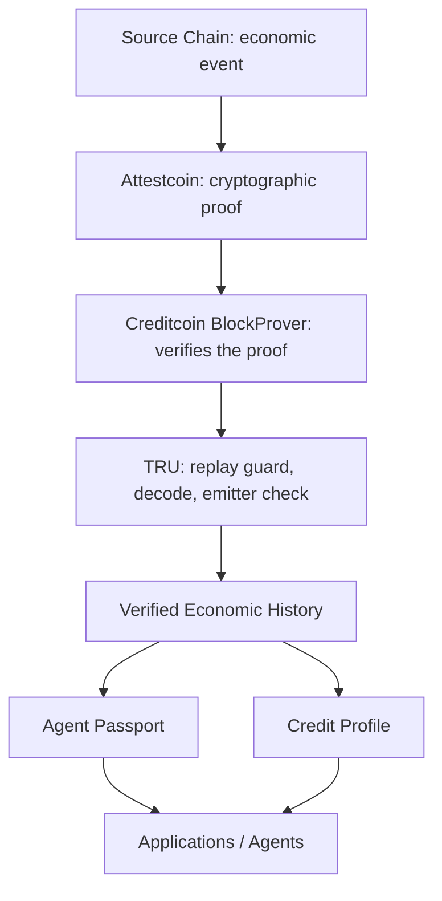

# TRU: Verifiable Economic History for Autonomous Agents

TRU makes an agent's economic history verifiable instead of trusted.

## The Problem

Autonomous agents act across chains: completing obligations, repaying loans, performing work for counterparties. But none of that activity becomes reusable, verifiable history. The next agent or protocol that wants to work with them has no way to check what they have actually done. It can only trust what the agent claims, or trust a third-party API that says "this agent is reliable."

TRU solves this by turning cross-chain economic events into cryptographic proof that lives on Creditcoin. An agent's history becomes something other protocols can verify directly, without trusting the agent or any intermediary.

## The Agent Passport

An Agent Passport is the primary output of TRU. It is a deterministic, on-chain record derived entirely from verified economic events.

```
Agent performs economic obligation
  -> Obligation is completed
  -> Source-chain event is proven via Attestcoin
  -> Creditcoin records the verified fact
  -> Agent Passport updates
```

A Passport contains:

| Field | What it means |
| --- | --- |
| `verifiedObligations` | Distinct obligations created for this agent |
| `completedObligations` | Distinct obligations this agent completed |
| `failedObligations` | Distinct obligations that failed |
| `activeObligations` | Obligations still in progress |
| `verifiedSettlementVolume` | Total value settled across completed obligations |
| `verifiedSourceChains` | Distinct chains where activity was verified |
| `completionRateBps` | Completion rate in basis points (e.g., 10000 = 100%) |
| `obligationHistory` | Full chronological event history |

Every field is recomputed live from on-chain records. No AI, no subjective scoring, no token ownership, no NFT metadata. An agent has a Passport because it did verifiable work, not because someone assigned it a score.

Other protocols and agents read the Passport and apply their own policy: require a minimum completion rate, a threshold settlement volume, or activity on specific chains. TRU supplies the evidence. The consumer decides what it means.

## How It Works

TRU uses the Attestcoin protocol (Creditcoin Universal Smart Contracts) to prove that an event happened on a source chain:

```
Source Chain (Ethereum Sepolia)
  SourceObligationMarket emits ObligationCreated / ObligationCompleted
  SourceLoanMarket emits LoanCreated / LoanRepaid
        |
        v
Attestcoin
  Creditcoin attests the source block
  Proof builder returns a Merkle + continuity proof
        |
        v
TRU Worker (off-chain)
  Waits for attestation, builds proof, submits to TRUUniversalContract
        |
        v
TRUUniversalContract (Creditcoin CC3)
  Verifies proof via BlockProver precompile
  Checks emitter matches configured source market
  Forwards verified facts to TRUCreditRegistry
        |
        v
TRUCreditRegistry (Creditcoin CC3)
  Records verified events
  Updates Agent Passport / Credit Profile
```

The worker is a relay. It transports proof bytes and never decides what gets credited. Only proof verification success plus the emitter check can write registry state.

## Live Testnet Proof

Every entry below was verified against live RPCs. Sepolia links open Etherscan; CC3 links open Creditcoin testnet Blockscout.

| Step | Source tx (Sepolia) | Proof tx (CC3) | Result |
| --- | --- | --- | --- |
| Agent `0x8FC1…` creates obligation | [`0x9591e621…`](https://sepolia.etherscan.io/tx/0x9591e6219585e73fc1c3e10421e5a818347b50254d6e9cf99e2cdfdd71677617) block `11663848` | [`0xe7961a54…`](https://creditcoin-testnet.blockscout.com/tx/0xe7961a54e83e2b57a47fd02189fd37ae503f50421798c53cadc2751f208dd5a1) block `5454388` | `ACTIVE` |
| Agent `0x8FC1…` completes obligation | [`0x3aa9af68…`](https://sepolia.etherscan.io/tx/0x3aa9af68306d2e646d491b48de3878ebc5d093f05414e88dac7e949bf491a40c) block `11663849` | [`0xc19bc7df…`](https://creditcoin-testnet.blockscout.com/tx/0xc19bc7df91805a135d5b4a3a1191c53488cc76ee6f3050b3f56f7bb35d0226b8) block `5454391` | `COMPLETED` |
| Agent Passport for `0x8FC1…` | n/a | n/a | `verified 1, completed 1, active 0, volume 9000, 10000 bps, chains [1]` |

A second self-obligation for `0x2b37…` (create `0x5a2757…`, complete `0x9eb372…`) was also verified live, showing the primitive works for both human and agent addresses.

## Verified Events

TRU supports four event types through the same verification pipeline:

- **Obligation created** (`ObligationCreated`): a requester assigns an economic obligation to an executor
- **Obligation completed** (`ObligationCompleted`): the designated executor fulfills the obligation
- **Loan originated** (`LoanCreated`): a borrower takes out a loan
- **Loan repaid** (`LoanRepaid`): the borrower repays

Loans are the first application of the verification primitive. Obligations generalize it to any economic actor, including autonomous agents.

## Credit History

Loan repayment history for human borrowers is the second product surface. A borrower's profile updates with each verified repayment:

```
repayments = number of verified repayments
totalRepaid = sum of verified amounts
creditLimit = 0 + repayments * 100
creditState = NEW (0) -> BUILDING (1-2) -> ESTABLISHED (3-5) -> VERIFIED (6+)
```

`TRUFinancing` gates `requestFinancing` on `creditState >= BUILDING` and `amount <= creditLimit` without disbursing funds.



## Architecture

```
Sepolia (Ethereum)                               Creditcoin CC3 Testnet
-------------------                               ----------------------
SourceLoanMarket                                  BlockProver precompile 0x...0FD2
 createLoan() -> LoanCreated                      verifyAndEmit(proof) -> reverts
 repayLoan()  -> LoanRepaid                       on any tampered byte
SourceObligationMarket
 createObligation() -> ObligationCreated
 completeObligation() -> ObligationCompleted
      |  tx hash (any market)
      v
 worker (off-chain relay + proof construction)
  polls attested height
  ProofBuilder.getProof(txHash)
  ---------- USC proof ---------------------->
                                    +------------------------------+
                                    | TRUUniversalContract         |
                                    | processedQueries[queryId]    |
                                    | decode event from verified    |
                                    | receipt, check emitter        |
                                    +--------------+---+-----------+
                                                   |   |
                                          Loan*   Obligation*
                                                   |   |
                                          TRUCreditRegistry (CC3)
                                           obligationStatus
                                           subjectObligationHistory
                                           getAgentPassport / getObligationEvents
                                           loanStatus / borrowerEvents
                                           getCreditEvidence / getCreditPassport
                                                   |
                                                   v
                                          Downstream consumers
                                           TRUFinancing (reads getCreditEvidence)
                                           Any app/agent (reads getAgentPassport)
```

Both loan and obligation events flow through the same `verifyAndEmit` + emitter + replay checks. The worker is a relay and proof-construction component: it transports proof bytes and never decides what gets credited.

## Security

- **Emitter validation:** each decoder requires the log emitter to equal the configured source market; obligation decoders fail closed when the market is unset
- **Replay protection:** `processedQueries[keccak(chainKey, blockHeight, txIndex)]` in the universal contract plus per-domain replay maps in the registry
- **Duplicate protection:** `countedLoans[borrower][loanId]`, `loanStatus`, and `obligationStatus` reject second crediting of the same loan or obligation
- **Source-chain validation:** `chainKey` and `blockHeight` bind the proof to one chain and block
- **Registry authorization:** all record functions are `onlyUniversalContract`; admin setters are owner-only
- **Event isolation:** loan and obligation histories use separate mappings and views
- **Proof verification:** state changes only after `verifyAndEmit` success; tampered bytes revert

## Testing

`forge test`: **92 passed, 0 failed, 0 skipped** across 8 suites:
- 7 `SourceLoanMarket`
- 7 `SourceObligationMarket`
- 7 `TRUFinancing`
- 13 `TRUUniversalContract`
- 47 `TRUCreditRegistry`
- 11 audit (relay-boundary, rotation-immutability, lifecycle-pinning, gas-scaling, UC-admin, full-path replay/tamper)

Obligation coverage: 7-test `SourceObligationMarket` suite, 13 obligation lifecycle and passport tests in the registry suite, 4 obligation decode tests in the UC suite, and 5 obligation-focused audit tests.

## Current Limitations

- Testnet only; no mainnet state exists
- `failedObligations` is deterministically 0 because `ObligationFailed` has a source event but no verified path yet
- Neither source completion nor the registry enforces deadlines
- Obligation and loan IDs live in single-market namespaces (one market per type assumed)
- Passport views loop in O(n^2), correct at current volume (33k gas at 2 obligations, 159k at 8)
- The deployment owner key is fully trusted (can re-point markets/registry); separate before production
- Proof submission is permissionless (no access control on UC `execute*` functions, only proof-validity and replay checks)
- Self-obligations (`requester == executor`) verify and count like any other event; the `requester` field keeps this visible on-chain, but the protocol does not discount self-created history
- Cold attestation takes 7-9 minutes (predictable from the attested-height gap, not reducible)
- `queryId = keccak(chainKey, blockHeight, txIndex)` carries no event type, so two different event types in one source transaction would collide
- `TRUFinancing` approves on eligibility alone with no disbursement

## Repository Structure

```
contracts/src/sepolia/        SourceLoanMarket, SourceObligationMarket
contracts/src/creditcoin/     TRUUniversalContract, TRUCreditRegistry, TRUFinancing
contracts/src/creditcoin/interfaces/  ITRUCreditRegistry (shared types)
contracts/test/               8 Forge suites, 92 tests
contracts/deployments/        current addresses + ABIs (single source of truth)
creditcoin/src/worker.mjs     proof relay for all four event types
creditcoin/src/driver.mjs     source-chain helper (create/repay loans)
creditcoin/src/deploy-production.mjs  deploys + wires all five contracts
docs/                         architecture, security, and integration docs
```

## Getting Started

Requires Sepolia and Creditcoin CC3 testnet RPC endpoints plus funded testnet keys in `creditcoin/.env` (`SOURCE_RPC_URL`, `SEPOLIA_PRIVATE_KEY`, `CREDITCOIN_RPC_URL`, `CREDITCOIN_PRIVATE_KEY`, `PROOF_BUILDER_URL`).

```bash
cd contracts
forge build
forge test
```

```bash
cd creditcoin
node src/deploy-production.mjs
```

This deploys `SourceLoanMarket` and `SourceObligationMarket` to Sepolia, then `TRUCreditRegistry`, `TRUUniversalContract`, and `TRUFinancing` to CC3, and configures `TRUCreditRegistry.setUniversalContract`. All addresses and ABIs are written to `contracts/deployments`.

```bash
# from the repository root: process a single loan or obligation event (auto-detected)
node creditcoin/src/worker.mjs --tx <sepoliaTxHash>

# listen from a block
node creditcoin/src/worker.mjs --from-block <N> --process-count 1
```

Live frontend: https://tru-ctc.vercel.app

## Future Work

- Verified failure lifecycle (`ObligationFailed` source event exists, TRU verification not yet implemented)
- Unified loan-plus-obligation timeline view
- Additional source chains
- Mainnet deployment

## Contract Addresses

| Contract | Chain | Address | Deploy Tx |
| --- | --- | --- | --- |
| SourceLoanMarket | Sepolia (`11155111`) | `0x9953AC50803f85EaA666B7724a7B165504B9c2e1` | `0xfdd5cb3e248a78aa232f32e963a090c6f0b7452af33a92ba4c2ddb870fdc0993` |
| SourceObligationMarket | Sepolia (`11155111`) | `0x133A8Fe8408066B95034Ed638f5C7083Be94d14F` | `0x174d715ab49b14836a90118e06ec58a67bfd755242af8053b2f31ec6b0a6079e` |
| TRUCreditRegistry | CC3 (`102031`) | `0x0D2707D258A87b971fd4cd78232304a672CA43c0` | `0x54e5f166cf17048ee471ef2e4699677f9afd1fbf095ff15bd7f47cc032689d27` |
| TRUUniversalContract | CC3 (`102031`) | `0xa33fd898502de87aA52C5992483b74f471613Ef0` | `0x1264d53753736398f33330340f983e4be5f0f336f514a2f13af612105b64a125` |
| TRUFinancing | CC3 (`102031`) | `0xd971aeaAc0D7216c41CccEdc5F4d6EF539Cad0bB` | `0x634cbf7119c03c1d3a4d6bcb96e592ef22cce2770717ce80eaa3ef33d7f0bca6` |
| EvmV1Decoder (deployed library) | CC3 | `0x731c345d79Fb8BbDC541f9DF3b6317585F849F9f` | |
| BlockProver precompile | CC3 | `0x0000000000000000000000000000000000000FD2` | |
| ChainInfo precompile | CC3 | `0x0000000000000000000000000000000000000fd3` | |

## Technical Documentation

- `docs/VERIFIABLE_ECONOMIC_HISTORY.md`, the obligation extension: design, trust model, tests, live verification with exact hashes and blocks
- `docs/PRODUCT_ARCHITECTURE.md`, product mapping, core primitive evidence, canonical narrative
- `docs/ENGINE_AUDIT.md`, the shared five-step primitive, history storage, passport derivations, remaining limitations
- `docs/SECURITY_AUDIT.md`, full audit: trust model, verification boundary, access control, replay/duplicate protection
- `docs/ATTESTCOIN-INTEGRATION.md`, why Attestcoin is load-bearing, SDK calls, attestation timing, tamper walkthrough
- `docs/agent-domain-audit.md`, obligation struct, passport fields, test coverage, live evidence, and security comparison
