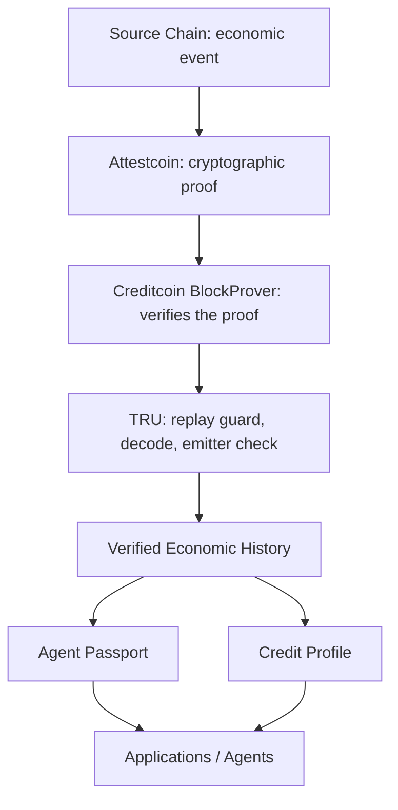

# TRU

> TRU makes an agent's economic history verifiable instead of trusted.

## 1. The Problem

Autonomous agents, protocols, and human borrowers all perform economic activity across multiple chains. But that activity does not automatically become reusable, verifiable history.

If Agent A completes an obligation on Ethereum, a protocol on another chain has no way to verify that it happened. It can only trust what Agent A claims, or trust a third-party API that says "this agent is reliable." Both options require trust. Neither provides proof.

The same problem exists for human borrowers. A repayment on Ethereum Sepolia does not automatically become credit history on Creditcoin. Every existing solution asks you to trust the reporter rather than the evidence.

TRU solves this by verifying cross-chain economic events through Attestcoin and recording them on Creditcoin as reusable history. An agent's Passport or a borrower's credit profile becomes something other protocols can verify directly, without trusting anyone.

## 2. The Solution

TRU is a verification pipeline with one output: verified economic history.

```
Economic event on source chain (Ethereum Sepolia)
  -> Attestcoin evidence (Creditcoin attests the source block, proof builder returns Merkle + continuity proof)
    -> TRU verification (TRUUniversalContract checks proof, emitter, replay)
      -> Creditcoin record (TRUCreditRegistry stores verified fact)
        -> Reusable economic history (Agent Passport, Credit Profile)
```

The same pipeline handles four event types today:

- **Obligation created** (`ObligationCreated`): a requester assigns an economic obligation to an executor
- **Obligation completed** (`ObligationCompleted`): the designated executor fulfills the obligation
- **Loan originated** (`LoanCreated`): a borrower takes out a loan
- **Loan repaid** (`LoanRepaid`): the borrower repays

Loans are the first application. Obligations generalize the primitive to any economic actor, including autonomous agents. Both flow through identical verification, replay protection, and emitter checks.

## 3. Agent Passport

The Agent Passport is the primary output of TRU. It is a deterministic, on-chain record derived entirely from verified economic events.

### What it contains

| Field | What it means |
| --- | --- |
| `verifiedObligations` | Distinct obligations created for this agent |
| `completedObligations` | Distinct obligations this agent completed |
| `failedObligations` | Distinct obligations that failed |
| `activeObligations` | Obligations still in progress |
| `verifiedSettlementVolume` | Total value settled across completed obligations |
| `verifiedSourceChains` | Distinct chains where activity was verified |
| `completionRateBps` | Completion rate in basis points (10000 = 100%) |
| `obligationHistory` | Full chronological event history |

Every field is recomputed live from on-chain records on every call. The struct is returned by `TRUCreditRegistry.getAgentPassport(subject)` and defined in `ITRUCreditRegistry.sol`.

### What it is not

- **Not an AI-generated reputation score.** No LLM, no model calls, no learned parameters anywhere in contracts, worker, or tests.
- **Not subjective scoring.** Every field traces to a USC-verified event. An agent has a Passport because it did verifiable work, not because someone assigned it a score.
- **Not self-reported history.** Only events that passed `verifyAndEmit` on-chain are recorded. Self-reported claims, centralized APIs, and third-party scores are not part of the system.

### How other protocols use it

Another protocol calls `getAgentPassport(B)` (view call, no gas for reads), receives the nine fields, and applies its own policy: require a minimum completion rate, a threshold settlement volume, or activity on specific chains. TRU supplies the evidence. The consumer decides what it means.

```
Agent A wants to transact with Agent B
  -> calls TRUCreditRegistry.getAgentPassport(B) on Creditcoin
  -> receives: verifiedObligations, completedObligations, activeObligations,
     verifiedSettlementVolume, completionRateBps, verifiedSourceChains,
     obligationHistory
  -> applies its own policy (e.g. completionRateBps >= 8000 and
     verifiedSettlementVolume >= threshold and sourceChain == 1)
  -> decides whether and how to transact
```

## 4. How It Works

### The verification pipeline

```
Source Chain (Sepolia)
  SourceObligationMarket emits ObligationCreated / ObligationCompleted
  SourceLoanMarket emits LoanCreated / LoanRepaid
        |
        v
Attestcoin
  Creditcoin attests the source block (~35-block standing lag,
  10-block batches; cold attestation ~7-9 min, predictable,
  already-attested blocks instant)
  Proof builder returns Merkle + continuity proof for the tx hash
        |
        v
TRU Worker (off-chain)
  Waits for attestation, builds proof
  Sanity-checks with BlockProver verifySingle (eth_call)
  Submits to TRUUniversalContract
        |
        v
TRUUniversalContract (Creditcoin CC3)
  txIndex via precompile -> queryId = keccak(chainKey, blockHeight, txIndex)
  Replay guard -> verify -> decode expected event from verified receipt
  Emitter check against configured market -> forward to registry
        |
        v
TRUCreditRegistry (Creditcoin CC3)
  UC-gated record (replay + duplicate + lifecycle guards)
  Updates Agent Passport or Credit Profile
  Appends verified event history
```

The worker is a relay and proof-construction component. It transports proof bytes and never decides what gets credited. Only `verifyAndEmit` success plus the emitter check can write registry state.

### Architecture diagram

```
Sepolia (Ethereum)                               Creditcoin CC3 Testnet
-------------------                               ----------------------
SourceLoanMarket                                  BlockProver precompile 0x...0FD2
 createLoan() -> LoanCreated                      verifyAndEmit(proof) -> reverts
 repayLoan()  -> LoanRepaid                       on any tampered byte
SourceObligationMarket
 createObligation() -> ObligationCreated
 completeObligation() -> ObligationCompleted
      |  tx hash (any market)
      v
 worker (off-chain relay + proof construction)
  polls attested height
  ProofBuilder.getProof(txHash)
  ---------- USC proof ---------------------->
                                    +------------------------------+
                                    | TRUUniversalContract         |
                                    | processedQueries[queryId]    |
                                    | decode event from verified    |
                                    | receipt, check emitter        |
                                    +--------------+---+-----------+
                                                   |   |
                                          Loan*   Obligation*
                                                   |   |
                                          TRUCreditRegistry (CC3)
                                           obligationStatus
                                           subjectObligationHistory
                                           getAgentPassport / getObligationEvents
                                           loanStatus / borrowerEvents
                                           getCreditEvidence / getCreditPassport
                                                   |
                                                   v
                                          Downstream consumers
                                           TRUFinancing (reads getCreditEvidence)
                                           Any app/agent (reads getAgentPassport)
```

### Mermaid flow



## 5. Live Proofs

Every entry below was verified against live RPCs. Sepolia links open Etherscan; CC3 links open Creditcoin testnet Blockscout.

### Agent obligation flow (0x8FC1...)

| Step | Source tx (Sepolia) | Proof tx (CC3) | Result |
| --- | --- | --- | --- |
| Creates obligation | [`0x9591e621…`](https://sepolia.etherscan.io/tx/0x9591e6219585e73fc1c3e10421e5a818347b50254d6e9cf99e2cdfdd71677617) block `11663848` | [`0xe7961a54…`](https://creditcoin-testnet.blockscout.com/tx/0xe7961a54e83e2b57a47fd02189fd37ae503f50421798c53cadc2751f208dd5a1) block `5454388` | `ACTIVE` (464.0s cold attestation) |
| Completes obligation | [`0x3aa9af68…`](https://sepolia.etherscan.io/tx/0x3aa9af68306d2e646d491b48de3878ebc5d093f05414e88dac7e949bf491a40c) block `11663849` | [`0xc19bc7df…`](https://creditcoin-testnet.blockscout.com/tx/0xc19bc7df91805a135d5b4a3a1191c53488cc76ee6f3050b3f56f7bb35d0226b8) block `5454391` | `COMPLETED` (2.3s, already attested) |
| Agent Passport | n/a | n/a | `verified 1, completed 1, active 0, volume 9000, 10000 bps, chains [1]` |

### Self-obligation (0x2b37...)

| Step | Source tx (Sepolia) | Proof tx (CC3) |
| --- | --- | --- |
| Creates obligation | `0x5a2757…` block `11663734` | `0x720a42a9…` block `5454297` |
| Completes obligation | `0x9eb372…` block `11663735` | `0xf342b72c…` block `5454298` |

Agent Passport: `verified 1, completed 1, active 0, settlement 8000, rate 10000`. This confirms the primitive works for both human and agent addresses.

### Loan flow (0x2b37...)

| Step | Source tx (Sepolia) | Proof tx (CC3) | Result |
| --- | --- | --- | --- |
| Loan originated | [`0x74d0e459…`](https://sepolia.etherscan.io/tx/0x74d0e459379fb89894db4d2b7903f15cb18ec27e90669c0f8743380f9749ac8a) block `11580721` | [`0xdd9e4e71…`](https://creditcoin-testnet.blockscout.com/tx/0xdd9e4e7183c816776aab9b69b45f5578406035555181fee24ee5bc09bccfaf3c) block `5385429` | `loanStatus ACTIVE` |
| Loan repaid | [`0xc21ea7d1…`](https://sepolia.etherscan.io/tx/0xc21ea7d1505fcbbc10ff1ebbf1e5774e3608296652cb0bca17787bd35a34db8e) block `11581259` | [`0xe0a48f58…`](https://creditcoin-testnet.blockscout.com/tx/0xe0a48f58639dcb7aab0d1f84ffe6eeade1df7076eaf9040fb815ee660d5f2b4d) block `5385870` | `repayments 1, totalRepaid 123456789, creditLimit 100, BUILDING` |
| `requestFinancing(50)` | CC3-only call | [`0xa8117461…`](https://creditcoin-testnet.blockscout.com/tx/0xa8117461a266471e2b67ebccc8d5d7f302d3e6484f31d2698872f0613525b097) block `5385873` | recorded; over-limit and NEW-state requests revert |

## 6. Attestcoin Integration

TRU uses the Attestcoin protocol (Creditcoin Universal Smart Contracts) to prove that a source-chain event actually happened. The integration path:

1. **Source event:** `SourceObligationMarket` or `SourceLoanMarket` on Sepolia emits a log (`ObligationCreated`, `ObligationCompleted`, `LoanCreated`, or `LoanRepaid`).

2. **Attestation:** Creditcoin attests the source block. There is a standing lag of ~35 blocks with 10-block batches. Cold attestation (first event on a new block) takes 7-9 minutes. Already-attested blocks return instantly.

3. **Proof generation:** The proof builder (`ProofBuilder.getProof(txHash)`) returns a Merkle proof plus continuity proof for the transaction. The worker sanity-checks with `BlockProver.verifySingle` (eth_call) before submitting.

4. **On-chain verification:** `TRUUniversalContract` calls the BlockProver precompile (`verifyAndEmit`) at `0x...0FD2`. The precompile proves transaction inclusion in the attested block and reverts on any tampered byte.

5. **Query ID:** `queryId = keccak(chainKey, blockHeight, transactionIndex)`. This is the unique, replay-guarded identifier for every verified event.

6. **Decode and emitter check:** The contract decodes the expected event type from the verified receipt logs. Each decoder checks that `log.address_` matches the configured source market (`Not SourceLoanMarket emitter` / `Not SourceObligationMarket emitter`).

7. **Registry recording:** Verified facts are forwarded to `TRUCreditRegistry` through UC-gated record functions. The registry enforces replay protection (`processedQueries`), duplicate protection (`countedLoans` / `obligationStatus`), and lifecycle guards.

All four entry points (`execute`, `executeLoanOrigination`, `executeObligationCreated`, `executeObligationCompleted`) run the same five-step sequence. Only the decode branch (event signature, topic layout, emitter address) and the registry call differ.

## 7. Security / Verification Guarantees

Confirmed by the Forge test suite (92 tests) and live testnet runs:

- **Proof verification:** state changes only after `verifyAndEmit` success. Tampered bytes, wrong events, failed source transactions, and non-UC callers all revert with explicit reasons.
- **Emitter validation:** each decoder requires the log emitter to equal the configured source market. Obligation decoders fail closed when the market is unset.
- **Replay protection:** `processedQueries[keccak(chainKey, blockHeight, txIndex)]` in the universal contract plus per-domain replay maps (`processedRepayments`, `processedOriginations`, `processedObligationCreations`, `processedObligationCompletions`) in the registry. Live replays revert `Query already processed`.
- **Duplicate protection:** `countedLoans[borrower][loanId]`, `loanStatus`, and `obligationStatus` reject second crediting of the same loan or obligation.
- **Source-chain validation:** `chainKey` and `blockHeight` passed to `verifyAndEmit` bind the proof to one chain and block. A proof for another chain or block fails verification.
- **Registry authorization:** all four record functions are `onlyUniversalContract`. Admin setters (`setUniversalContract`, `setRegistry`, `setSourceLoanMarket`, `setSourceObligationMarket`) are owner-only with zero-address rejection.
- **Event isolation:** loan and obligation histories use separate mappings and views. Loan accounting never reads obligation storage and vice versa (`test_loanAndObligationHistoriesAreIsolated`).
- **Executor mismatch guard:** obligation completions verify that `msg.sender` (the executor) matches the executor recorded at creation (`Executor mismatch`).
- **Self-obligation dedup:** when `requester == executor`, the event is pushed only once to the subject's history, preventing double-counting.

## 8. Current Limitations

- **Testnet only.** No mainnet state exists. All contracts are deployed on Sepolia (source) and Creditcoin CC3 testnet (verification).
- **No verified failure path.** `ObligationFailed` exists as a source event in `SourceObligationMarket` but TRU does not verify it. `failedObligations` is deterministically 0.
- **No deadline enforcement.** Neither source completion nor the registry enforces the obligation deadline.
- **Single-market namespaces.** Obligation and loan IDs live in one market per type. IDs are global within each market.
- **O(n^2) passport views.** `getAgentPassport` and `getCreditEvidence` scan history with nested dedup loops. Gas grows superlinearly: passport 33k at 2 obligations vs 159k at 8; evidence 3.9k at 2 repayments vs 24k at 8. All state-changing writes are O(1).
- **Owner key fully trusted.** The deployment owner can re-point markets and registry. On testnet the operator key currently equals the owner key. Separate before production.
- **Permissionless proof submission.** No access control on UC `execute*` functions, only proof-validity and replay checks. Additional relayers can run without coordination.
- **Self-obligation not discounted.** `requester == executor` obligations verify and count like any other event. The `requester` field keeps this visible on-chain, but the protocol does not discount self-created history.
- **Cold attestation 7-9 minutes.** Predictable from the attested-height gap, not reducible.
- **queryId collision risk.** `queryId = keccak(chainKey, blockHeight, txIndex)` carries no event type. Two different event types in one source transaction would collide and the second could never be recorded.
- **No disbursement.** `TRUFinancing` approves on eligibility alone (`creditState >= BUILDING` and `amount <= creditLimit`) without disbursing funds.
- **Superlinear view cost.** The passport and evidence views scan history with nested loops. Safe at current volume; first bottleneck to remove in production (incremental counters).

## 9. Roadmap / Future Consumers

The following are not implemented. Each would consume verified history rather than rebuilding verification:

- **Verified failure lifecycle.** `ObligationFailed` source event exists; `executeObligationFailed` path not yet built.
- **Underwriting against proven histories.** Lenders read Agent Passport or Credit Profile and apply their own risk policy.
- **Delegated execution gated on track records.** Protocols require a minimum completion rate or settlement volume before delegating work.
- **Merchant and counterparty risk decisions.** Read verified event history instead of relying on self-reported reputation.
- **Autonomous finance between agents.** Agents read each other's Passports and apply their own thresholds before transacting.
- **Unified timeline view.** Merge loan and obligation histories into a single chronological view.
- **Additional source chains.** Attestcoin already supports Ethereum mainnet; worker queries `getSupportedChains`.
- **Mainnet deployment.** Current system is testnet only.

## 10. Tech Stack & Contracts

### Source chain (Ethereum Sepolia)

| Contract | Purpose |
| --- | --- |
| `SourceLoanMarket` | Creates loans for `msg.sender`, accepts repayment from the owning borrower while active. Emits `LoanCreated` and `LoanRepaid`. Knows nothing about Creditcoin. |
| `SourceObligationMarket` | Creates obligations naming any executor with a value and deadline; completion restricted to the designated executor while active. Emits `ObligationCreated`, `ObligationCompleted`, `ObligationFailed`. Knows nothing about Creditcoin. |

### Verification chain (Creditcoin CC3 Testnet)

| Contract | Purpose |
| --- | --- |
| `TRUUniversalContract` | Verification front door. Four entry points sharing one replay guard and one proof path. Per-type receipt decoders with per-market emitter checks. Contains no credit logic. |
| `TRUCreditRegistry` | History store. UC-gated record functions with replay, duplicate, lifecycle, and executor-mismatch guards. Deterministic `CreditState` tiers and `creditLimit = 0 + repayments*100`. `getAgentPassport` and paginated history views. Contains no proof logic. |
| `TRUFinancing` | Read-only consumer of verified credit state. Immutable registry reference. `requestFinancing` records (never disburses). |

### Off-chain

| Component | Purpose |
| --- | --- |
| `worker.mjs` | Proof relay for all four event types. Listens for source events, waits for attestation, builds proof, submits to TRUUniversalContract. |
| `driver.mjs` | Source-chain helper for creating and repaying loans (testing). |
| `deploy-production.mjs` | Deploys and wires all five contracts. |

### Testing

`forge test`: **92 passed, 0 failed, 0 skipped** across 8 suites:
- 7 `SourceLoanMarket`
- 7 `SourceObligationMarket`
- 7 `TRUFinancing`
- 13 `TRUUniversalContract`
- 47 `TRUCreditRegistry`
- 11 audit (relay-boundary, rotation-immutability, lifecycle-pinning, gas-scaling, UC-admin, full-path replay/tamper)

Obligation coverage: 7-test `SourceObligationMarket` suite, 13 obligation lifecycle and passport tests in the registry suite, 4 obligation decode tests in the UC suite, and 5 obligation-focused audit tests.

### Repository structure

```
contracts/src/sepolia/        SourceLoanMarket, SourceObligationMarket
contracts/src/creditcoin/     TRUUniversalContract, TRUCreditRegistry, TRUFinancing
contracts/src/creditcoin/interfaces/  ITRUCreditRegistry (shared types)
contracts/test/               8 Forge suites, 92 tests
contracts/deployments/        current addresses + ABIs (single source of truth)
creditcoin/src/worker.mjs     proof relay for all four event types
creditcoin/src/driver.mjs     source-chain helper (create/repay loans)
creditcoin/src/deploy-production.mjs  deploys + wires all five contracts
docs/                         architecture, security, and integration docs
```

### Getting Started

Requires Sepolia and Creditcoin CC3 testnet RPC endpoints plus funded testnet keys in `creditcoin/.env` (`SOURCE_RPC_URL`, `SEPOLIA_PRIVATE_KEY`, `CREDITCOIN_RPC_URL`, `CREDITCOIN_PRIVATE_KEY`, `PROOF_BUILDER_URL`).

```bash
cd contracts
forge build
forge test
```

```bash
cd creditcoin
node src/deploy-production.mjs
```

This deploys `SourceLoanMarket` and `SourceObligationMarket` to Sepolia, then `TRUCreditRegistry`, `TRUUniversalContract`, and `TRUFinancing` to CC3, and configures `TRUCreditRegistry.setUniversalContract`. All addresses and ABIs are written to `contracts/deployments`.

```bash
# from the repository root: process a single loan or obligation event (auto-detected)
node creditcoin/src/worker.mjs --tx <sepoliaTxHash>

# listen from a block
node creditcoin/src/worker.mjs --from-block <N> --process-count 1
```

Live frontend: https://tru-ctc.vercel.app

## Contract Addresses

| Contract | Chain | Address | Deploy Tx |
| --- | --- | --- | --- |
| SourceLoanMarket | Sepolia (`11155111`) | `0x9953AC50803f85EaA666B7724a7B165504B9c2e1` | `0xfdd5cb3e248a78aa232f32e963a090c6f0b7452af33a92ba4c2ddb870fdc0993` |
| SourceObligationMarket | Sepolia (`11155111`) | `0x133A8Fe8408066B95034Ed638f5C7083Be94d14F` | `0x174d715ab49b14836a90118e06ec58a67bfd755242af8053b2f31ec6b0a6079e` |
| TRUCreditRegistry | CC3 (`102031`) | `0x0D2707D258A87b971fd4cd78232304a672CA43c0` | `0x54e5f166cf17048ee471ef2e4699677f9afd1fbf095ff15bd7f47cc032689d27` |
| TRUUniversalContract | CC3 (`102031`) | `0xa33fd898502de87aA52C5992483b74f471613Ef0` | `0x1264d53753736398f33330340f983e4be5f0f336f514a2f13af612105b64a125` |
| TRUFinancing | CC3 (`102031`) | `0xd971aeaAc0D7216c41CccEdc5F4d6EF539Cad0bB` | `0x634cbf7119c03c1d3a4d6bcb96e592ef22cce2770717ce80eaa3ef33d7f0bca6` |
| EvmV1Decoder (deployed library) | CC3 | `0x731c345d79Fb8BbDC541f9DF3b6317585F849F9f` | |
| BlockProver precompile | CC3 | `0x0000000000000000000000000000000000000FD2` | |
| ChainInfo precompile | CC3 | `0x0000000000000000000000000000000000000fd3` | |

## Technical Documentation

- `docs/VERIFIABLE_ECONOMIC_HISTORY.md`, the obligation extension: design, trust model, tests, live verification with exact hashes and blocks
- `docs/PRODUCT_ARCHITECTURE.md`, product mapping, core primitive evidence, canonical narrative
- `docs/ENGINE_AUDIT.md`, the shared five-step primitive, history storage, passport derivations, remaining limitations
- `docs/SECURITY_AUDIT.md`, full audit: trust model, verification boundary, access control, replay/duplicate protection
- `docs/ATTESTCOIN-INTEGRATION.md`, why Attestcoin is load-bearing, SDK calls, attestation timing, tamper walkthrough
- `docs/agent-domain-audit.md`, obligation struct, passport fields, test coverage, live evidence, and security comparison
